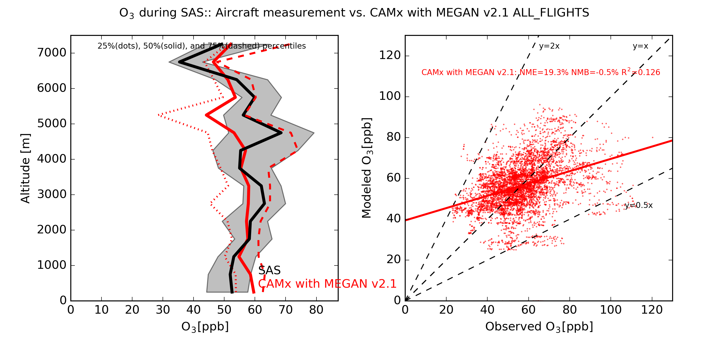

# aircraft_MPE

Compare CAMx 3D outputs to aircraft measurements.

## steps

    1_step0/run.diag_plane.step0.mrg60.for_3D.job : Output CAMx grid indexes (i,j,k) along the flight path with date and time. Input files are CAMx 2D and 3D meteorology files and an aircraft flight path ASCII file.
    
    2_extract/run.diag_plane.extract.mrg60.camx3D.megan2.1.job : Extract CAMx results at the grid cells drived above. Input files are CAMx 3D model results, aircraft measurement data, species mapping file between aircraft species and CAMx species, and the grid index file, which is the output from step 1.
    
    run.plot_vert_scat_var.camx3D.megan2.1.job : Make a vertical profile and a scatter plot using the result from step 2.

